# Blog App

## 概要
  閲覧者との活発なコミュニケーションを楽しみたい発信者に向けて開発したブログアプリです。 
  通常の投稿全体に対するコメントだけでなく、記事内の「特定の文」に対してピンポイントでコメントを残せる機能を備えています。 
  管理者（記事作成者）のコメントを視覚的に強調することで、読者の疑問に対する補足や回答が埋もれない設計にしています。

- **開発の背景・経緯**
    - 従来のブログで、記事のどの部分に対する感想や質問なのかが伝わりにくいと思うことがありました。
    - 文単位でコメントができることで、読者が「この部分に補足がほしい」「この一文に共感した」といった具体的なフィードバックを伝えやすくなると考え、この機能を実装しました。

- **公開URL**
    - https://nate-next-blog-app.vercel.app/

- **管理者アカウント**
    - email : admin2@example.com
    - Password : password

## 特徴と機能の説明
- **投稿記事**

  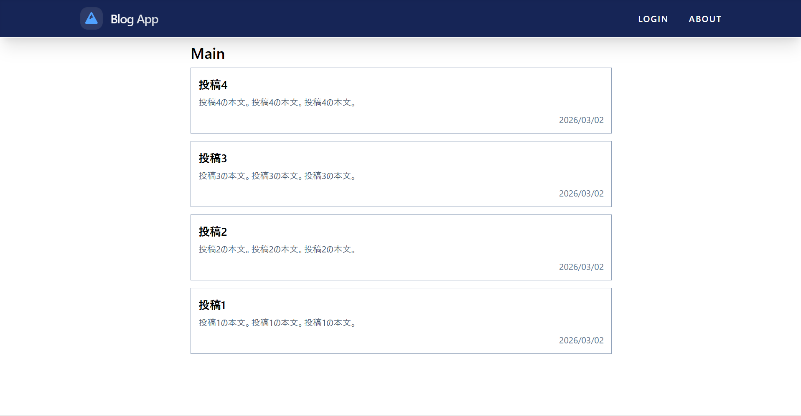

  投稿記事一覧ページで閲覧したい記事をクリックすることで記事の閲覧が可能です

  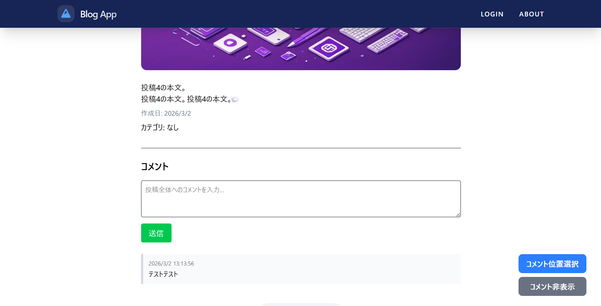

  記事の詳細ページではインラインコメントと一般的なコメントができます。

  一般的なコメントは入力欄にテキストを入力し、送信ボタンを押すことでコメントすることができます。 

- **インラインコメント機能**

  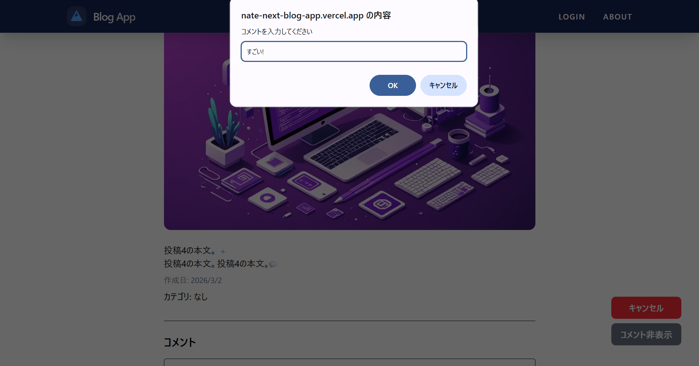

  特定の文にコメントまたは補足をしたい場合に使用することを想定しています。

  画面右下のコメント位置選択ボタンをクリックすることで位置選択モードになります。もう一度クリックすることでモードを解除できます。

  位置選択モードでコメントしたい文をクリックすることでウィンドウが表示され、テキストを入力しokを押すことでコメントできます。

  コメントした文に吹き出しアイコンが表示されます

  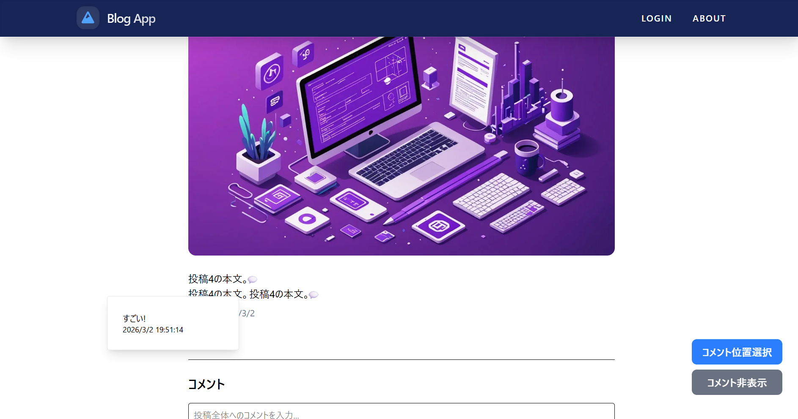

  位置選択モードでないときに吹き出しアイコンをクリックすることでコメントを表示することができます。

  文章を改行ごとに分解し、文単位で「+」のコメントアンカーを配置しています。一つの文に対して複数のコメントを紐づけることが可能です。

  コメント位置選択ボタンの下の非表示、表示ボタンで、インラインコメントの表示を切り替えることができます。

- **管理者コメントの識別表示**

  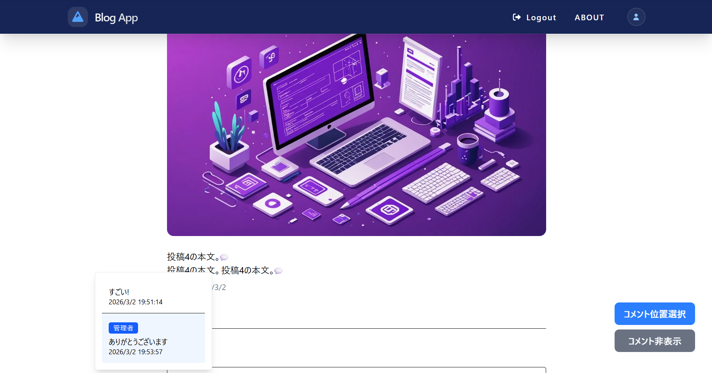

  管理者IDを用いて、管理者による返信や補足を一般閲覧者のコメントと明確に区別して表示します。

- **ログイン機能**

  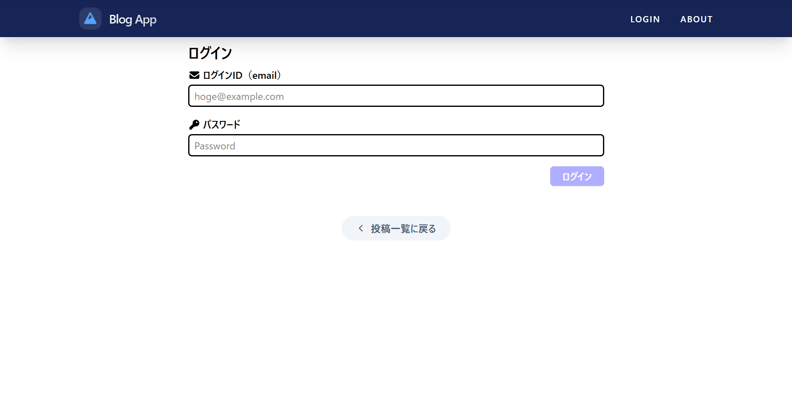

  画面右上のログインをクリックすることでログイン画面に移動します。

  ログインは管理者のemail、Passwordを入力することで行うことができます。

  ログイン後はヘッダーに管理者アカウントアイコンが表示され、「login」が「logout」に変わります。

  ログイン後には管理用ページに移動します。

  管理用ページのリンクをクリックすることでそれぞれの管理ページに移動します。

- **投稿記事一覧(管理用)**

  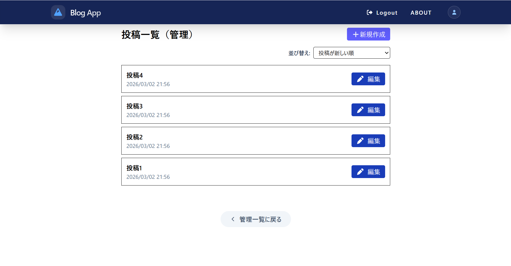

  投稿記事が確認でき、各投稿の編集ボタンをクリックすることで記事の編集を行うことができます。

  投稿記事の並び替えを行うことができ、投稿日時が古い順、新しい順で並び替えができます。

  右上の新規作成ボタンをクリックすることで記事の新規作成ができます。

- **記事の新規作成**

  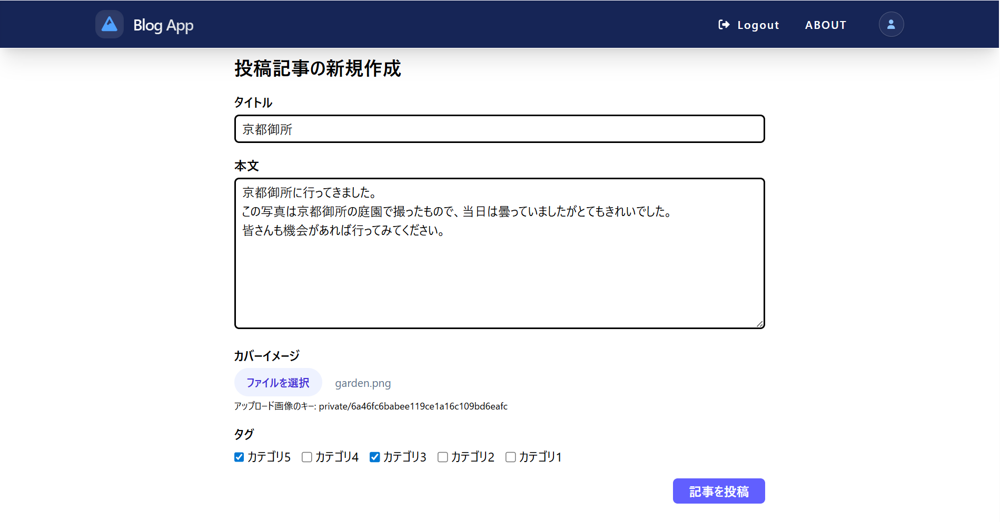

  記事の新規作成を行うことができ、タイトル、本文、カバー画像、カテゴリを入力し投稿ボタンをクリックすることで入力した内容を投稿します。

  カバー画像は選択ボタンをクリックし、選択します。画像を選択しないと記事の投稿はできません。

  カテゴリはチェックボックスをクリックすることで選択でき、複数のカテゴリを選択できます。

- **記事の編集**

  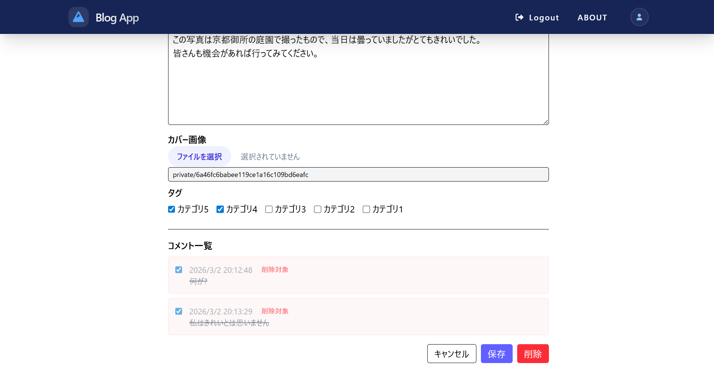

  投稿されている記事の編集、削除を行うことができ、タイトル、本文、カバー画像、カテゴリを編集、コメントは削除できます。

  保存をクリックすると変更が保存され、削除をクリックすると警告ウィンドウが出現し、okを押すと記事が削除されます。

  キャンセルをクリックすると変更を破棄し、編集前のままになります。

- **カテゴリ一覧**

  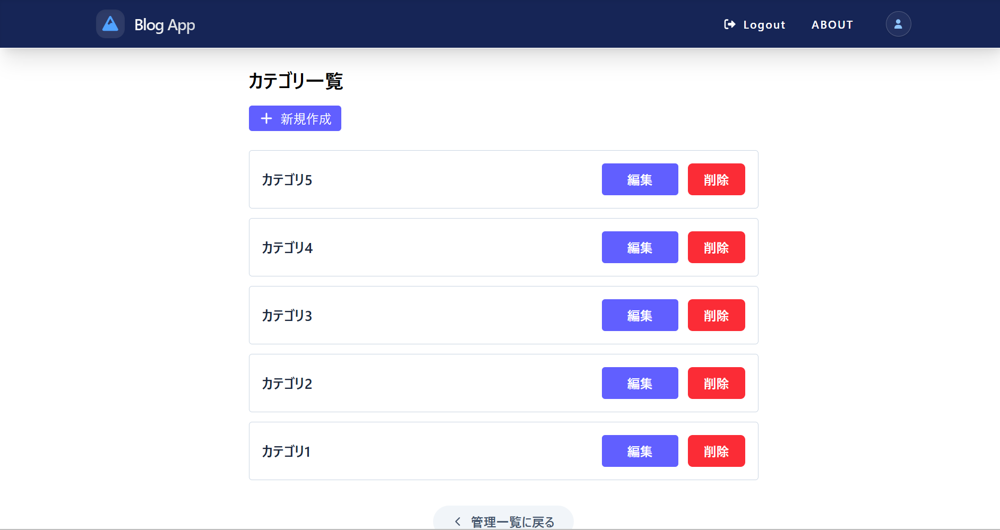

  投稿記事一覧(管理用)と同様にカテゴリが確認でき、各カテゴリの編集ボタンをクリックすることでカテゴリの編集を行うことができます。

  削除ボタンを押すことで警告の後削除ができます

- **カテゴリの新規作成**

  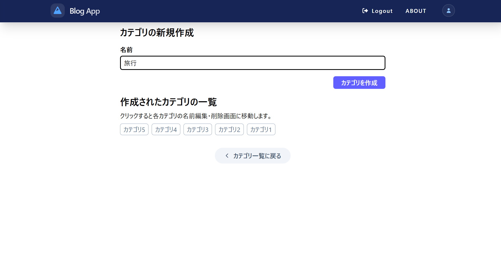

  入力欄に新しいカテゴリ名を入れてカテゴリを作成をクリックすると新しいカテゴリが作成できます。
  
  下に表示されているカテゴリをクリックすることでクリックしたカテゴリの編集を行うことができます。

- **カテゴリの編集**

  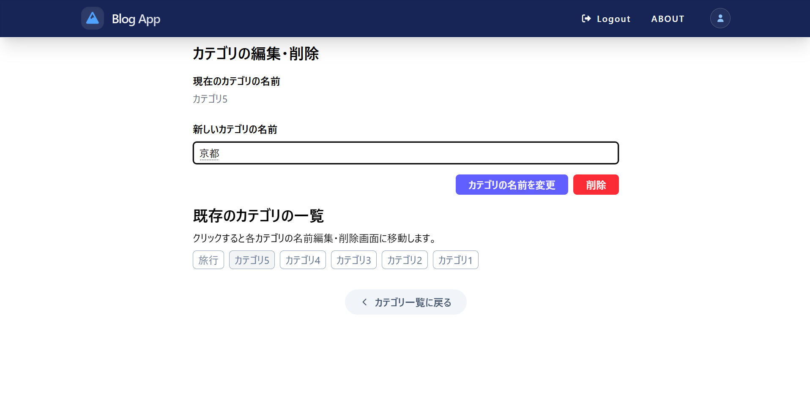

  カテゴリの名前を変更、削除することができます。

  新規作成と同様にクリックしたカテゴリの編集を行うことができます。

## 使用技術 (技術スタック)

- **使用した言語やフレームワーク**
    - **TypeScript**: コードの堅牢性を確保し、バグの少ない開発を行うために採用しました。
    - **Next.js**: 高速なページ遷移と効率的なルーティングを実現するために使用しました。
    - **Prisma**: データベース操作を型安全に行い、データ構造の管理を容易にするために導入しました。
    - **CryptoJS**: 画像アップロード時のファイル名重複を防ぐため、MD5ハッシュ値の計算に使用しました。

- **開発に使用したツールやウェブサービス**
    - **VSCode**: 効率的なコーディングと拡張機能の活用のためメインエディタとして使用しました。
    - **Supabase**: ユーザー認証、データベース管理、および画像ストレージとして全面的に活用しました。
    - **Vercel**: アプリケーションのデプロイとホスティングに使用しました。

- **システム構成図**

  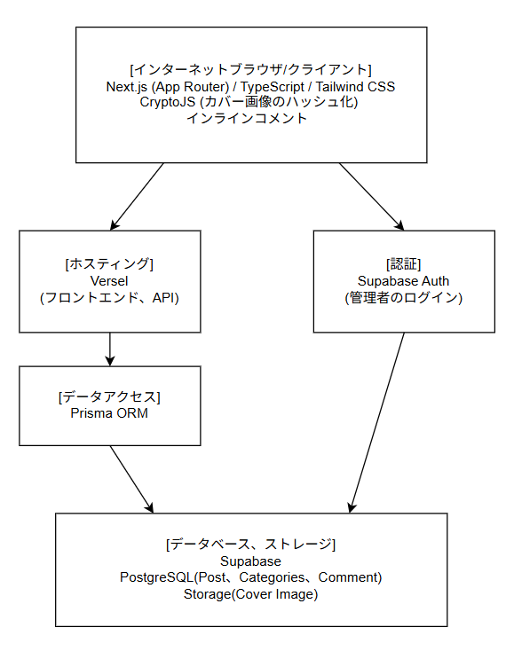

## 開発期間・体制

- **開発体制**: 個人開発
- **開発期間**: 2025.11.13 ~ 2026.03.03 (約80時間)

## 工夫した点・苦労した点

- **文単位のコメント実装とデータ構造**
    - 文ごとにコメントを投稿できるよう、本文テキストを分解してコメントアンカーを動的に配置するロジックを工夫しました。また、一つの箇所に複数人のコメントが重なっても正しく表示されるよう実装しました。
- **管理者と閲覧者の視覚的な差別化**
    - 管理者のIDを判別し、コメントの背景色やラベルを動的に切り替えることで、記事作成者からの公式な回答が一目でわかるようにしました。
- **自律的なエラー解決**
    - 実装中に直面したエラーや不明点については、インターネットの調査やAIを効果的に活用して解決し、なるべく自力で機能実装しました。

## 既知の課題と今後の展望

- **マルチユーザー投稿機能**
    - 現状は管理者のみが投稿・編集を行えますが、今後は一般ユーザーもアカウントを作成し、各自がブログを投稿・管理できる仕組みを作りたいと考えています。
- **リアクション・コミュニティ機能**
    - 読者が手軽に反応できる「いいね機能」や、安全なコミュニティ維持のための「BAN機能（迷惑ユーザー制限）」を実装予定です。

- **使用したアイコン**
    - FLATICON
    https://www.flaticon.com/free-icon/stingray_4799403?term=stingray&page=1&position=28&origin=search